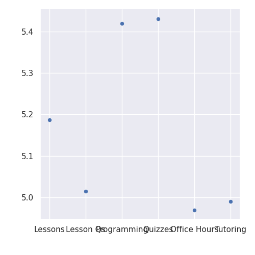

---
# Do not edit the text between these lines!
layout: default
---

# Welcome to my website!

## Grace Wang

This is Grace's website.

COMP110 Resource Effectiveness Analysis
Grace Wang
<!-- what do you think of this website -->

## Overview

In this project, we examined survey data from COMP110 students to determine which course resources are most helpful for learning. The resources we focused on include lesson videos, post-lesson questions, programming assignments, quizzes, office hours, and tutoring.

The purpose of this analysis is to understand which tools provide the most value to students and to explore ways the course could be improved using real data.

---

## Visualizations

### Chart 1: Average Effectiveness of Course Resources

This chart displays the average effectiveness ratings for each resource. Lesson videos and post-lesson questions seem to have the highest scores.

---

### Chart 2: Distribution of Resource Effectiveness

This chart illustrates how effectiveness ratings are spread across the different resources.

---

### Chart 3: Resource Effectiveness Comparison

This visualization compares the performance of different learning resources relative to one another.

---

## Conclusion

The findings indicate that lesson videos and post-lesson questions are among the most effective learning tools in COMP110. Since these resources are built into the course and widely used, they likely play a major role in helping students understand the material.

Programming assignments are also beneficial, though slightly less impactful. Office hours and tutoring received lower ratings, which may be due to fewer students using them regularly or only relying on them when they are struggling.

Overall, focusing on improving lesson videos and post-lesson questions could have the greatest positive impact on student learning. However, this may require additional effort from instructors. In the future, collecting more detailed data on how frequently students use each resource could provide further insight.